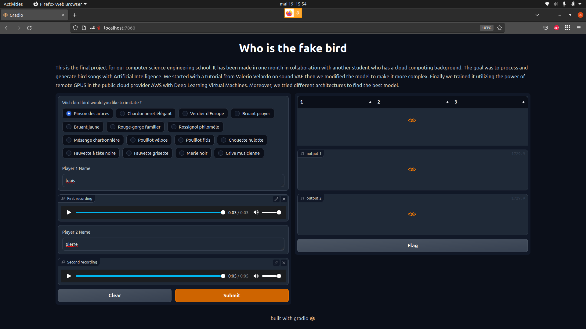
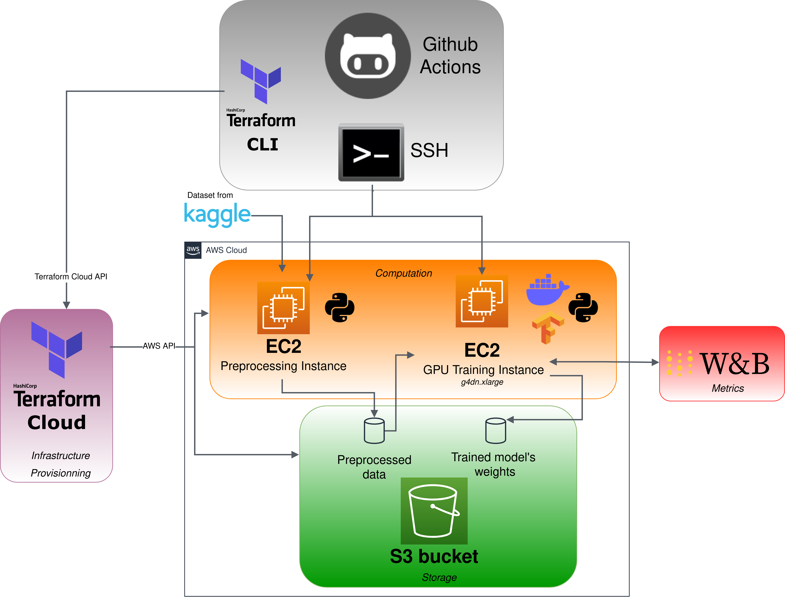

# **Sound Processing Python Application**
A Full-Stack Python application for birdsong sound processing using Deep Learning.
### **Technical Stack**
- Python (3.8)
- Tensorflow (GPU)
- Gradio (Frontend)
- W&B (https://wandb.ai/site)
- Librosa
- FastAPI (Backend)
- Docker

### **Requirements** 
- docker (20.10.14)
- docker-compose (1.29.2)

## **Running the App**
First, copy the model_trained directory (given privately) at the **_backend/model/deployment/_** location. Then create the empty directory **_backend/preprocess/tmp_preprocess_**  
In the project's root directory :
```sh
$ docker-compose up
```
When all applications are loaded you can find the app at http://localhost:7860


For more details on the model itself, visit https://github.com/sonicpierre/Music_VAE 
# **On-demand GPU Deep Learning Virtual Machines and Training on AWS**
Utilizing Github Actions to automatically provision an infrastructure (GPU EC2 instance) and train a Deep Learning model on AWS. The result (weights) is then saved into a remote storage system (S3 bucket). 
### **Technical Stack**
- Github Actions
- AWS
- EC2 (GPU instances)
- S3
- Terraform
- Terraform Cloud (https://cloud.hashicorp.com/products/terraform)
- W&B (https://wandb.ai/site)


### **Important note**
Running the infrastructure on AWS is **NOT** free of charge. Please be very cautious since GPU instances can rapidly become expensive (**0.5$/hour** for a medium machine). You will be charged for storage and computation based on :
- uptime
- any network traffic leaving the AWS platform (downloading is free but uploading to the outside will be charged) 
### **Requirements** 
- A public Github repository **_Free_**
- A GitHub Personnal Access Token (with access to your repository) **_Free_**
- Creating an SSH keypair on AWS **_Free_**  
- An AWS Account with a vCPU Limit Increase for All G instances **_Charge-Based_** (https://docs.aws.amazon.com/general/latest/gr/aws_service_limits.html) 
- A Terraform Cloud Account **_Free_** (For more information to setup Terraform Cloud and github actions see https://learn.hashicorp.com/tutorials/terraform/github-actions)
### **Infrastructure**


### **Github Actions Secrets**
The github action workflows need the following secrets for the jobs to succeed :
- **AWS_EC2_PRIVATE_KEY** (the private SSH key from the keypair generated to SSH to the AWS EC2 instances)
- **KAGGLE_API_CREDS** (JSON Credentials from a Kaggle account)
- **TF_API_TOKEN** (Terraform Cloud API Token)
- **WANDB_API_TOKEN** (WANDB API key)

### **Triggering the Github Pipeline**
To trigger the pipeline you need to do a POST request to the Github API. The request should be as followed :
```sh
curl -X POST -H "Authorization: token **INSERT_YOUR_TOKEN_HERE**"  -H 'Accept: application/vnd.github.everest-preview+json' "https://api.github.com/repos/**YOUR_GITHUB_USERNAME**/**YOUR_REPOSITORY_NAME**/dispatches" -d '{"event_type": "training-infra", "client_payload": {"preprocessing": 0,"training":1}}'
```
With the client_payload, you have the ability to do both preprocessing and training steps or skip one of those jobs.(preprocessing or training = 0 -> skipping this step else do it)

### **Authors**
Pierre Virgaux & Louis CHOMEL